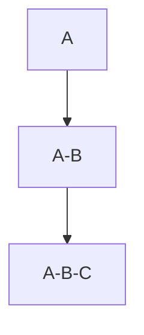
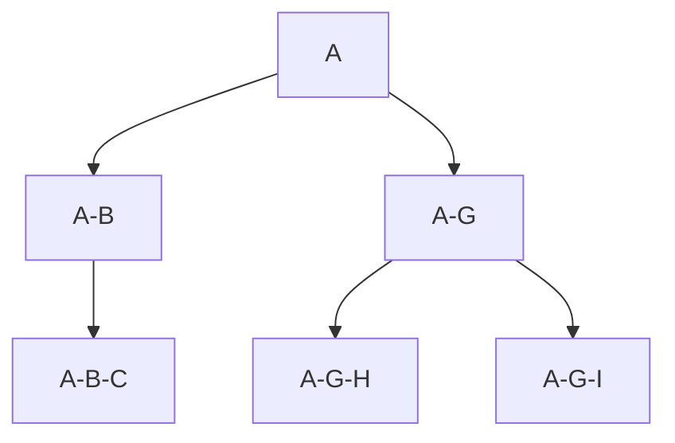

WPM-Import-SN-Folders-Roles-v1.json: 
- Import Secret Notes from .csv file for a specific user
- Creates Secret Notes in the user context
- Creates Folders in the user context
- Add SN to respective Folders
- Creates a roll up of Roles depending on the folder name (e.g. a folder with name A-B-C will create roles: A, A-B, A-B-C)
- TODO: Share folder to latest role (e.g. share foler A-B-C to role A-B-C)
- TODO: Roll up role permissions (e.g. A will be member of A-B, A-B will be member of A-B-C)

The idea is to create a folder structure with higher level access roles

In the above example: a member of role A-G will have access to folders A-G-H & A-G-J

WPM-clear-secured-items.json
- Will delete all SN for the specific user

WPM-clear-folders
- Will delete all folders for the specific user

WPM-Clear-Roles-with-P.json
- will delete all roles that start with P
