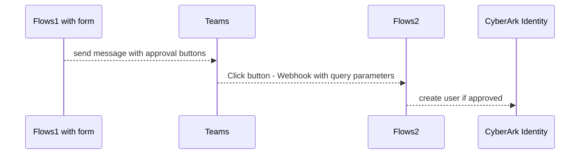

- Form to enter new user details
- Send message to slack with Deny and Approve button
- Click button calls a flow to handle the results

```mermaid
sequenceDiagram
Flows1 with form-->>Teams:send message with approval buttons
Teams-->>Flows2:Click button - Webhook with query parameters
Flows2-->>CyberArk Identity:create user if approved
```
