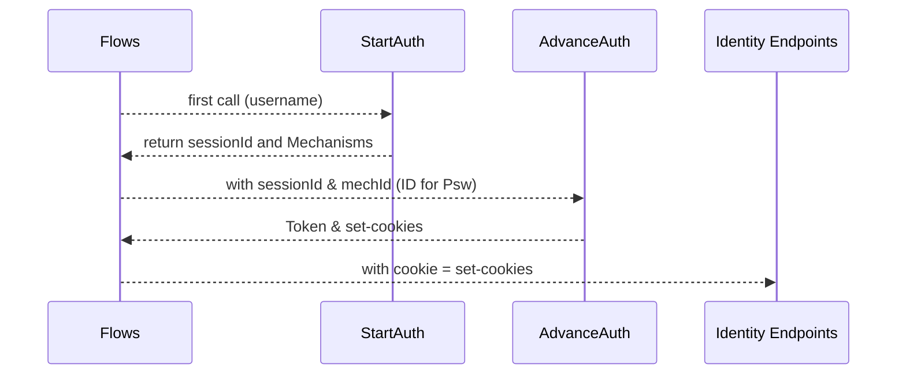
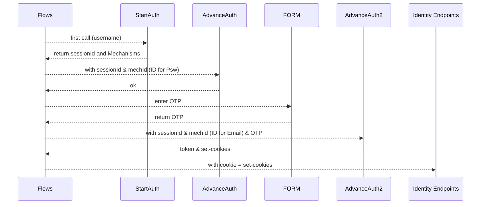
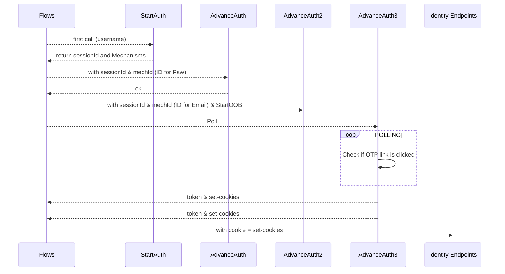

Flows to authenticate a user whenever you need to run an API that requires a certain user context.
Examples you will find here:
1. Authenticate with username & password (Identity auth profile has to be setup with single psw factor)

2. Authenticate with u/p and a second factor, an OTP by email that needs to be entered in a form.

3. Authenticate with U/P + Email OTP but click on the short link of the email so that no user interaction is required in the flow.

