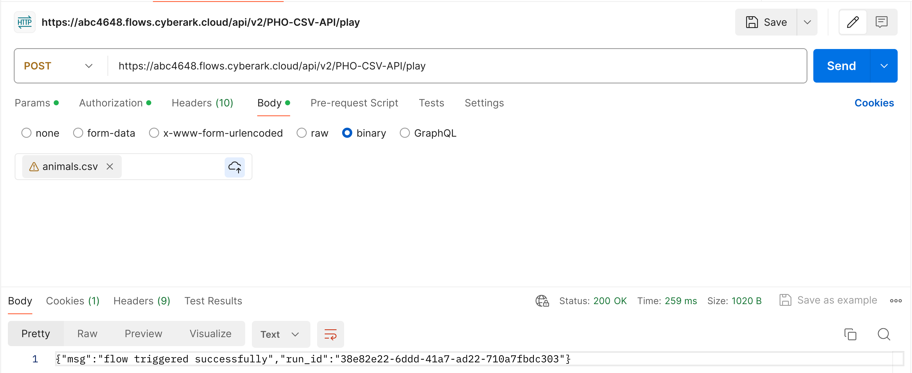

Import csv via API call

Flow name: PHO-CSV-API
Postman:
- send a body
- Use the binary format
- upload your .csv file in postman
- Make a post call to the flows url which is setup to allow API call
  

