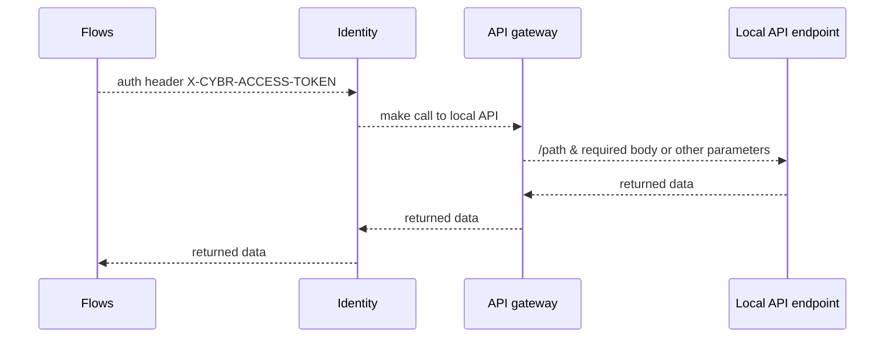

In this tutorial we will explain how to use the CyberArk Identity API gateway to make API calls on the local network without the need to expose those API's over the internet. 
The API gatgeway provides a way to make local API calls thanks to a gateway installed on the network.
We demonstrate how to authenticate to PAM-SH and retrieve a list with all safes.

